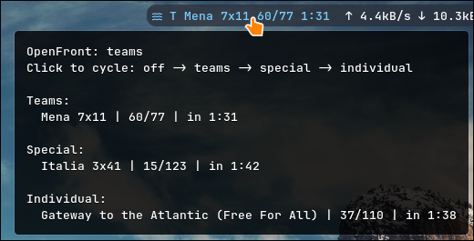

# of-lobbies

Watch [OpenFront.io](https://openfront.io) public lobbies from Waybar or the terminal.



*Hover the module to see all three lobby categories. The bar shows the active category's featured lobby.*


## Components

- `bin/of-lobbies-daemon` — background watcher, writes Waybar status JSON
- `bin/of-lobbies` — optional terminal lobby watcher
- `waybar/` — Waybar scripts and config snippets
- `systemd/of-lobbies.service` — user service for the daemon

## Requirements

- Python 3 with `websockets` (`pip install websockets`)
- Waybar
- pyenv shims on PATH for the systemd service

## Install

```bash
./install.sh
systemctl --user enable --now of-lobbies.service
```

Add the snippets from `waybar/config.snippet.jsonc` and `waybar/style.css.snippet` to your Waybar config if not already present.

## Usage

Click the Waybar module to cycle modes:

`off` → `teams` → `special` → `individual`

When a watch mode is active, the daemon keeps a WebSocket to `wss://openfront.io/w0/lobbies`. In `off` mode it stays idle with no network connection.

Terminal watcher:

```bash
of-lobbies
of-lobbies --mode teams
```

## Runtime state

Stored under `~/.local/state/of-lobbies/`:

- `mode` — current watch mode
- `status.json` — latest Waybar output
